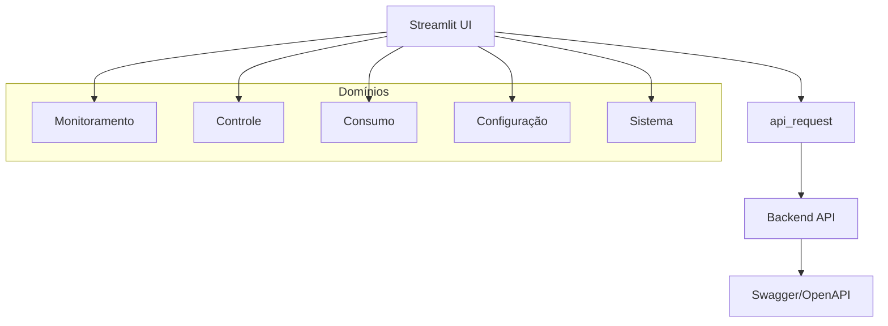
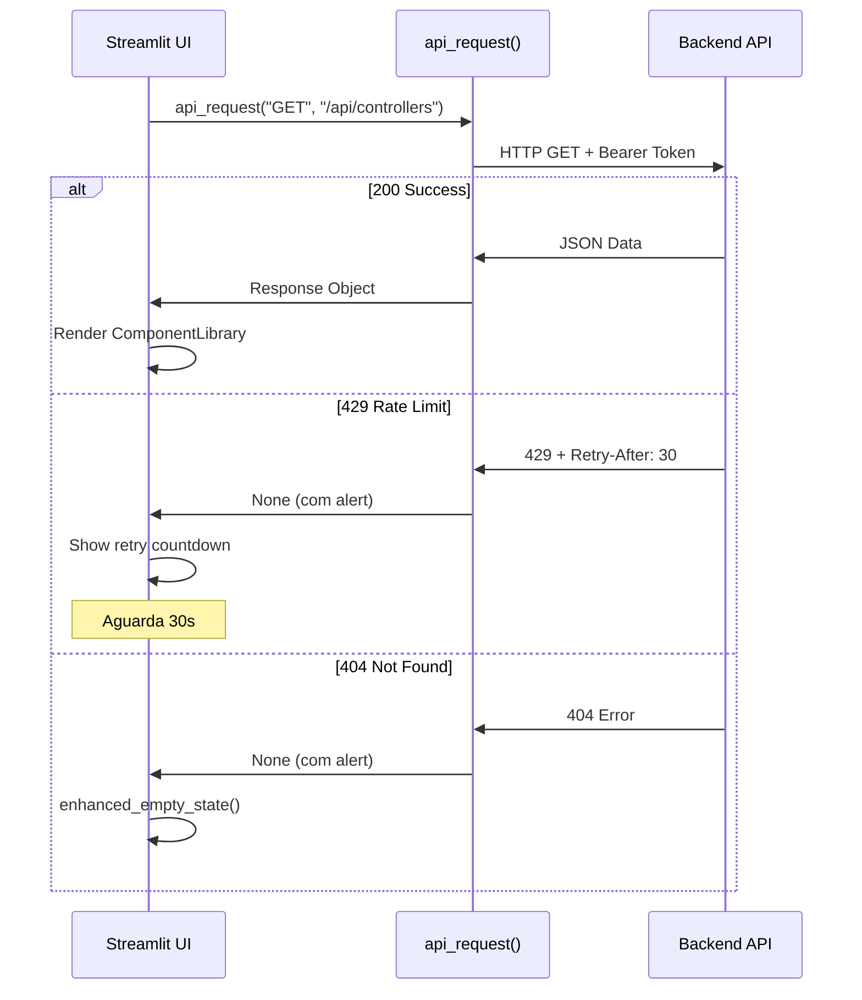

# IrrigoSystem Dashboard

> Dashboard para monitoramento e automação de sistemas de irrigação inteligente

## Índice

- [Visão Geral do Projeto](#visão-geral-do-projeto)
- [Arquitetura & Componentes](#arquitetura--componentes)
- [Mapeamento UI ↔ Swagger (Contratos)](#mapeamento-ui--swagger-contratos)
- [Padrões de UI e Validações](#padrões-de-ui-e-validações)
- [Como Rodar em Desenvolvimento](#como-rodar-em-desenvolvimento)
- [Qualidade & Testes](#qualidade--testes)
- [Fluxos de Trabalho Comuns](#fluxos-de-trabalho-comuns)
- [Guia de Contribuição Rápido](#guia-de-contribuição-rápido)
- [Segurança & Privacidade](#segurança--privacidade)
- [Apêndices](#apêndices)

## Visão Geral do Projeto

O **IrrigoSystem Dashboard** é uma aplicação Streamlit para monitoramento e controle de sistemas de irrigação inteligente. O sistema é organizado em 5 domínios principais:

- **Monitoramento**: Estações, sensores e medições de umidade do solo
- **Controle**: Controladores, válvulas e ativações de bombas de água
- **Consumo**: Análise de consumo de energia e água
- **Configuração**: Tarifas de energia e usuários do sistema
- **Sistema**: Dashboard principal e health checks



## Arquitetura & Componentes

### Estrutura de Pastas

```
├── app.py                 # Entrypoint principal (Streamlit)
├── api.py                # Cliente HTTP central
├── login.py              # Sistema de autenticação
├── requirements.txt      # Dependências do projeto
├── swagger.yml          # Especificação da API
├── src/
│   ├── ui_components.py    # UI Foundations v3 + ComponentLibrary
│   ├── design_tokens.py    # Design System (cores, espaçamentos)
│   ├── health.py          # Health checks da API
│   ├── dashboard.py       # Dashboard principal (/api/home)
│   ├── controllers.py     # CRUD de controladores
│   ├── valves.py         # CRUD de válvulas
│   ├── controller_activations.py  # Histórico de ativações
│   ├── monitoring_stations.py     # CRUD de estações
│   ├── measurements.py           # Medições dos sensores
│   ├── measurement_reports.py    # Relatórios de medições
│   ├── consumptions.py          # Tela unificada energia/água
│   ├── energy_consumptions.py   # (Deprecated - usar consumptions.py)
│   ├── water_consumptions.py    # (Deprecated - usar consumptions.py)
│   ├── tariff_schedules.py      # Tarifas de energia
│   └── users.py                # CRUD de usuários
└── tests/
    ├── test_consumo_energia_contract.py  # Testes de contrato
    └── test_tariff_schedules_contract.py # Testes de contrato
```

### Cliente HTTP Central

O arquivo `api.py` centraliza todas as chamadas HTTP:

```python
def api_request(method, endpoint, token=None, timeout=10, **kwargs):
    """
    Função utilitária para realizar chamadas à API,
    centralizando tratamento de erros e inclusão de cabeçalhos.
    """
```

**Status HTTP tratados:**
- `200`: Success
- `204`: Success (DELETE sem corpo)
- `400`: Bad Request (parâmetros inválidos)
- `404`: Not Found (recurso não existe)  
- `409`: Conflict (dados duplicados)
- `429`: Too Many Requests (com Retry-After)
- `500`: Server Error

### Decisão E402 (load_dotenv)

O projeto conscientemente aplica `load_dotenv()` antes dos imports nos arquivos `app.py` e `api.py`. Isso é uma decisão arquitetural para garantir que variáveis de ambiente estejam disponíveis durante o import dos módulos.

```python
# app.py
from dotenv import load_dotenv
load_dotenv()
# Imports após load_dotenv() (E402 aceito)
import streamlit as st
```

### Fluxo de uma Requisição Típica



## Mapeamento UI ↔ Swagger (Contratos)

| Módulo | Endpoint(s) Swagger | Parâmetros | Tipos | Status Tratados |
|--------|-------------------|------------|-------|-----------------|
| `controllers.py` | `GET /api/controllers`<br>`POST /api/controllers`<br>`PUT /api/controllers/{id}`<br>`DELETE /api/controllers/{id}` | `id` (int64)<br>`name`, `pumpPower` (double)<br>`efficiency`, `powerFactor` (double)<br>`latitude`, `longitude` (double) | Path: int64<br>Body: mixed | 200, 500 |
| `valves.py` | `GET /api/controllers/{controllerId}/valves`<br>`POST /api/controllers/{controllerId}/valves`<br>`PUT /api/controllers/{controllerId}/valves/{id}`<br>`DELETE /api/controllers/{controllerId}/valves/{id}` | `controllerId` (int64)<br>`id` (int32)<br>`flowRate` (double) | Path: int64, int32<br>Body: int32, double | 200, 404, 500 |
| `monitoring_stations.py` | `GET /api/monitoring-stations`<br>`POST /api/monitoring-stations`<br>`POST /api/monitoring-stations/{stationId}/sensors` | `stationId` (int64)<br>`name`, `latitude`, `longitude`<br>`moistureUpperLimit`, `moistureLowerLimit` | Path: int64<br>Body: double | 200, 500 |
| `measurements.py` | `GET /api/measurements` | `startDate`, `endDate` (date-time)<br>`stationId` (int32)<br>`sensorId` (int32)<br>`page`, `pageSize` (int32)<br>`sort` (string) | Query: mixed | 200, 500 |
| `measurement_reports.py` | `POST /api/measurements/current-average`<br>`POST /api/measurements/report` | `stationId` (int64)<br>`sensorIds` (array int64)<br>`variable`, `period` (string) | Body: mixed | 200, 400, 500 |
| `controller_activations.py` | `GET /api/controllers/{controllerId}/statuses` | `controllerId` (int64)<br>`startDate`, `endDate` (date-time)<br>`page`, `pageSize` (int32)<br>`sort` (string) | Path: int64<br>Query: mixed | 200, 404, 500 |
| `consumptions.py` | `GET /api/consumptions/energy`<br>`GET /api/consumptions/water` | `controllerId` (int64)<br>`period` (string) | Query: int64, string | 200, 400, 404, 500 |
| `tariff_schedules.py` | `GET /api/tariff-schedules`<br>`GET /api/tariff-schedules/current`<br>`POST /api/tariff-schedules`<br>`PUT /api/tariff-schedules/{id}`<br>`DELETE /api/tariff-schedules/{id}` | `id` (int64)<br>`date` (date-time)<br>`daytimeTariff`, `nighttimeTariff` (double)<br>`nighttimeDiscount` (double) | Path: int64<br>Body: mixed | 200, 404, 500 |
| `health.py` | `GET /api/health` | - | - | 200, 500 |
| `dashboard.py` | `GET /api/home` | - | - | 200, 404, 500 |
| `users.py` | `POST /api/users/create`<br>`DELETE /api/users/{email}`<br>`POST /api/users/login` | `email` (string)<br>`password` (string) | Path: string<br>Body: string | 200, 400, 409, 500 |

### Observações Importantes

- **DELETE** retorna status `204` sem corpo de resposta
- **sensorId** é singular em `/api/measurements` vs **sensorIds** (array) em relatórios
- **Paginação**: `page` (default: 1), `pageSize` (default: 15), `sort` (default: "desc")
- **Nomes**: Sempre usar exatamente como definido no Swagger (ex: `controllerId`, não `controller_id`)

## Padrões de UI e Validações (Batch B aplicado)

### Seletores Dependentes

Padrão `"Nome/Data (ID: X)"` com cache TTL de 120s:

```python
# Estação → Sensor
station_id, station_name = station_selector(token)
sensor_id, sensor_name = sensor_selector(token, station_id)

# Controlador → Válvula  
controller_id, controller_name = controller_selector(token)
valve_id, valve_name = valve_selector(token, controller_id)
```

### Datas e Horários

- **Pickers**: `st.date_input()` + `st.time_input()`
- **Default**: Últimos 7 dias
- **Exibição**: `dd/MM/yyyy HH:mm:ss`
- **Envio API**: ISO-8601 UTC Z (`2025-01-15T10:30:00Z`)
- **Limite de faixa**: 62-90 dias (configurável por tela)

```python
def format_datetime_for_api(date_value, time_value=None):
    """Converte para ISO-8601 UTC Z para envio à API."""
    if date_value:
        if time_value:
            dt = datetime.combine(date_value, time_value)
        else:
            dt = datetime.combine(date_value, time.min)
        return dt.strftime("%Y-%m-%dT%H:%M:%SZ")
```

### Inputs Numéricos Padronizados

```python
# Valores monetários
monetary_input(label, min_value=0.01, step=0.01)

# Percentuais  
percentage_input(label, min_value=0.0, max_value=100.0)

# Coordenadas geográficas
geographic_coordinates_input(lat_value=None, lon_value=None)

# Potência elétrica
power_input(label, min_value=1.0, max_value=50000.0, step=0.1)

# Eficiência/Fator de Potência
number_input(min_value=0.0, max_value=1.0, step=0.01)
```

### Estados e Mensagens

- **Loading**: `LoadingStates.spinner_with_cancel()` ou `progress_with_status()`
- **Empty**: `enhanced_empty_state()` com action buttons
- **Alerts**: `ComponentLibrary.alert()` com tipos: success, error, warning, info
- **Rate Limiting**: 429 respeitando `Retry-After` header

### Cache e Invalidação

```python
@st.cache_data(ttl=120)  # 2 minutos
def get_controllers_cached(token):
    return get_controllers(token)

# Invalidação pós-mutation
invalidate_caches_after_mutation("controllers")
```

### Persistência de Formulário

```python
# Salvar estado em caso de erro
save_form_state("form_key", form_data)

# Recuperar após erro
form_data = load_form_state("form_key")

# Limpar após sucesso
clear_form_state("form_key")
```

### Segurança

- **Inputs de senha**: `type="password"` 
- **Não logar segredos**: Nunca usar `st.write()` ou `print()` com tokens/senhas
- **Session state**: Não persistir credenciais sensíveis

## Como Rodar em Desenvolvimento

### Pré-requisitos

- Python 3.8+
- pip ou Poetry
- Git

### Setup

1. **Clone o repositório**
   ```bash
   git clone https://github.com/dmalberto/irrigosystem-dashboard
   cd irrigosystem-dashboard
   ```

2. **Crie e configure o .env**
   ```bash
   cp .env.example .env
   ```
   Preencha as variáveis conforme [.env.example](.env.example)

3. **Instale dependências**
   ```bash
   pip install -r requirements.txt
   ```

4. **Execute a aplicação**
   ```bash
   streamlit run app.py
   ```

5. **Acesse no navegador**
   ```
   http://localhost:8501
   ```

### Configuração da API

Configure a URL base da API no arquivo `.env`:

```bash
API_URL=http://localhost:5000  # ou URL do seu backend
```

### Troubleshooting Comum

- **Porta ocupada**: Use `streamlit run app.py --server.port 8502`
- **Variáveis ausentes**: Verifique se `.env` está preenchido
- **Erro de certificado**: Para desenvolvimento, configure `requests.verify=False` (não recomendado para produção)
- **Proxy corporativo**: Configure `HTTP_PROXY` e `HTTPS_PROXY` nas variáveis de ambiente

## Qualidade & Testes

### Comandos de Linting

```bash
# Verificar código
ruff check .

# Formatar código  
black --check .

# Ordenar imports
isort --check-only .

# Executar testes
pytest -q
```

### Política E402

O projeto **aceita conscientemente** E402 em `app.py` devido à necessidade arquitetural de executar `load_dotenv()` antes dos imports dos módulos.

### Smoke Tests

```bash
# Smoke test básico
python simple_smoke_test.py

# Smoke test completo (requer mocks)
python smoke_test_batch_b.py
```

**Interpretação dos resultados:**
- ✅ `[OK]` = Funcionalidade testada com sucesso
- ❌ `[ERROR]` = Falha que requer investigação

## Fluxos de Trabalho Comuns (para estagiários)

### Primeiro Bug

1. **Reproduzir o problema**
   - Siga os passos descritos no issue
   - Use developer tools do navegador (F12)
   - Verifique logs no terminal do Streamlit

2. **Criar branch e investigar**
   ```bash
   git checkout -b fix/issue-123
   # Investigar código relevante
   ```

3. **Testar e abrir PR**
   ```bash
   # Executar testes
   python simple_smoke_test.py
   ruff check .
   black --check .
   
   # Commit e push
   git add .
   git commit -m "fix: corrige problema XYZ"
   git push origin fix/issue-123
   ```

### Primeiro Endpoint

1. **Consultar Swagger**
   - Verifique `swagger.yml` para ver parâmetros exactos
   - Note tipos (int32, int64, double, string)

2. **Adicionar função no módulo apropriado**
   ```python
   def new_api_function(token, param1, param2):
       """GET /api/new-endpoint
       
       Parâmetros conforme Swagger:
       - param1 (int64): Descrição
       - param2 (string): Descrição
       """
       endpoint = "/api/new-endpoint"
       params = {"param1": param1, "param2": param2}
       response = api_request("GET", endpoint, token=token, params=params)
       
       return handle_api_response_v2(response, "Sucesso!")
   ```

3. **Integrar na UI**
   - Use `ComponentLibrary` para elementos visuais
   - Aplique validações com `ui_components.py`
   - Trate estados vazios com `enhanced_empty_state()`

### Primeira Tela/Formulário

1. **Reutilizar componentes existentes**
   ```python
   from src.ui_components import (
       ComponentLibrary,
       LoadingStates,
       enhanced_empty_state,
       controller_selector,
       monetary_input,
   )
   ```

2. **Seguir padrões estabelecidos**
   - Cache TTL de 120s para seletores
   - Formulários com `st.form()`
   - Validações antes de submissão
   - Loading states durante API calls

3. **Aplicar design tokens**
   ```python
   # Cards informativos
   ComponentLibrary.card(
       title="Título",
       content="Conteúdo",
       color="info"
   )
   
   # Métricas
   ComponentLibrary.metric_card(
       title="Métrica",
       value="100",
       icon="📊"
   )
   ```

## Guia de Contribuição Rápido

### Padrão de Branch/Commit

- **Branch**: `feat/nova-funcionalidade`, `fix/correcao-bug`, `refactor/melhoria-codigo`
- **Commit**: Seguir [Conventional Commits](https://www.conventionalcommits.org/pt-br/)
  ```bash
  feat: adiciona novo endpoint de relatórios
  fix: corrige validação de datas
  refactor: padroniza componentes de input
  ```

### Checklist de PR

- [ ] Código segue PEP8 (verificar com `ruff` e `black`)
- [ ] Imports organizados (`isort`)
- [ ] Testes passando (`pytest` ou smoke tests)
- [ ] Documentação atualizada se necessário
- [ ] Nenhum segredo exposto
- [ ] Parâmetros seguem nomes exatos do Swagger

### Convenções de Código

- **PEP8**: Seguir rigorosamente
- **Black**: Formatação automática (linha 88 chars)
- **Isort**: Imports organizados por categoria
- **Type Hints**: Usar quando possível
- **Docstrings**: Para funções públicas e classes

## Segurança & Privacidade

### Variáveis Sensíveis

- **Apenas no .env**: Tokens, senhas, URLs internas
- **Nunca committar**: `.env` está no `.gitignore`
- **Exemplo público**: Use `.env.example` sem valores reais

### Práticas Seguras

```python
# ✅ Correto
token = st.session_state.get("token")  # Não loga
password = st.text_input("Senha", type="password")

# ❌ Evitar
st.write(f"Token: {token}")  # Exposição em logs
st.session_state["password"] = password  # Persistência insegura
```

### Políticas

- **Tokens JWT**: Não persistir além da sessão
- **Logs**: Nunca incluir credenciais ou tokens
- **Session State**: Limpar dados sensíveis no logout

## Apêndices

### Glossário

- **Controller**: Dispositivo que controla válvulas e bombas de irrigação
- **Station**: Estação de monitoramento com sensores de umidade
- **Sensor**: Dispositivo que mede umidade, temperatura e salinidade do solo
- **Valve**: Válvula de irrigação controlada por um controlador
- **Tariff Schedule**: Tabela de tarifas de energia elétrica (diurna/noturna)
- **Measurement**: Leitura individual de um sensor
- **Activation**: Evento de acionamento de bomba/válvula

### Exemplos de Payloads

#### Criar Controlador
```json
{
  "name": "Controlador Setor Norte",
  "pumpPower": 1500.0,
  "efficiency": 0.85,
  "powerFactor": 0.9,
  "latitude": -23.5505,
  "longitude": -46.6333
}
```

#### Criar Estação de Monitoramento
```json
{
  "name": "Estação Principal",
  "latitude": -23.5505,
  "longitude": -46.6333,
  "moistureUpperLimit": 70.0,
  "moistureLowerLimit": 30.0,
  "controllerId": 123
}
```

#### Filtro de Medições
```json
{
  "startDate": "2025-01-01T00:00:00Z",
  "endDate": "2025-01-07T23:59:59Z",
  "stationId": 456,
  "sensorId": 789,
  "page": 1,
  "pageSize": 15,
  "sort": "desc"
}
```

### FAQ

**P: Por que erro 400/404/409?**
R: Verifique parâmetros obrigatórios, tipos de dados e se recursos existem.

**P: Por que erro 429?**
R: Rate limiting. O sistema automaticamente aguarda o tempo especificado no header `Retry-After`.

**P: Por que erro 500?**
R: Erro interno da API. Verifique logs do backend ou contate administrador.

**P: Por que limitar período de datas?**
R: Performance e limitação de recursos. Períodos muito longos podem sobrecarregar a API.

**P: Por que formato "(ID: X)" nos seletores?**
R: Clareza para o usuário sobre qual registro está sendo selecionado, especialmente quando nomes podem ser similares.

**P: Como debugar problemas de cache?**
R: Use `st.cache_data.clear()` ou reinicie a aplicação para limpar todos os caches.